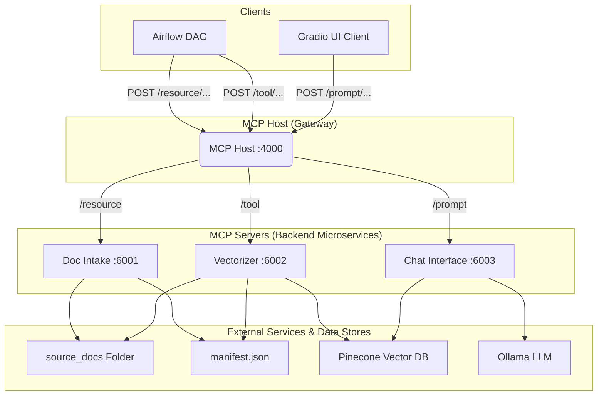

# Incremental Document RAG with MCP

This project implements a complete, microservice-based Retrieval-Augmented Generation (RAG) system based on the Model Context Protocol (MCP) architecture. It allows users to ask questions about a collection of PDF documents and receive answers from a local Large Language Model (LLM).

The system is designed to be incremental, only processing new or changed documents, and can be triggered both manually via an API and through an external orchestrator like Apache Airflow.

## Goals and Objectives

* **Modular Architecture:** To build a system composed of independent, single-responsibility microservices (doc intake, vectorizer, chat) for scalability and maintainability.
* **Centralized Routing:** To use a central host (MCP Host) to manage and route all incoming requests to the appropriate backend service, simplifying client interactions.
* **Incremental Processing:** To efficiently handle document collections by only processing new files, tracked via a `manifest.json` file.
* **Flexible Interaction:** To provide multiple ways to interact with the system, including a user-friendly web UI, direct API calls for testing, and integration points for workflow orchestrators like Airflow.
* **Scoped and Global Search:** To allow users to ask questions against a specific document or across the entire document library.

## Architecture Diagram



## Project Folder Structure

```
incredoc_rag/
│
├── .env
├── .gitignore
├── mcp_client/
│   └── app.py
│
├── mcp_host/
│   └── host.py
│
├── mcp_servers/
│   ├── incredoc_resource_doc_intake/
│   │   └── server.py
│   │
│   ├── incredoc_tool_vectorizer/
│   │   └── server.py
│   │
│   └── incredoc_prompt_doc_chat/
│       └── server.py
│
├── source_docs/
│   └── (Your PDF files go here)
│
├── manifest.json
└── requirements.txt
```

## Prerequisites

1.  **Python 3.10+**
2.  **Ollama**: The application must be installed and running.
3.  **Required Ollama Models**:
    ```bash
    ollama pull mistral
    ollama pull nomic-embed-text
    ```
4.  **Pinecone Account**:
    * Create a free account at [pinecone.io](https://www.pinecone.io/).
    * Create an index (e.g., `mcp-explore-768`) with dimensions set to **768**.
    * Note your API key.

## Installation

1.  **Clone the Repository.**
2.  **Create a `.env` file** in the project root (`incredoc_rag/`) and add your Pinecone API key:
    ```
    PINECONE_API_KEY="YOUR_PINECONE_API_KEY_HERE"
    ```
3.  **Install Python Dependencies:**
    ```bash
    pip install -r requirements.txt
    ```

## Running the Application

Each service must be run in its **own separate terminal window**.

1.  **Terminal 1: Start Doc Intake Server**
    ```bash
    cd mcp_servers/incredoc_resource_doc_intake
    python server.py
    ```
2.  **Terminal 2: Start Vectorizer Server**
    ```bash
    cd mcp_servers/incredoc_tool_vectorizer
    python server.py
    ```
3.  **Terminal 3: Start Doc Chat Server**
    ```bash
    cd mcp_servers/incredoc_prompt_doc_chat
    python server.py
    ```
4.  **Terminal 4: Start MCP Host**
    ```bash
    cd mcp_host
    python host.py
    ```
5.  **Terminal 5: Start Gradio UI Client**
    ```bash
    cd mcp_client
    python app.py
    ```

## Testing with `curl`

### Testing Servers Directly

* **Test Doc Intake (Port 6001):**
    ```bash
    curl -X POST http://localhost:6001/resource/incredoc.resource.doc_intake
    ```
* **Test Vectorizer (Port 6002):**
    ```bash
    curl -X POST http://localhost:6002/tool/vectorizer
    ```
* **Test Chat (Port 6003):**
    ```bash
    curl -X POST http://localhost:6003/prompt/doc_chat \
    -H "Content-Type: application/json" \
    -d '{"question": "What is covered?", "filename": "YOUR_FILENAME.pdf"}'
    ```

### Testing Through the MCP Host

* **Test Intake via Host (Port 4000):**
    ```bash
    curl -X POST http://localhost:4000/resource/incredoc.resource.doc_intake
    ```
* **Test Vectorizer via Host (Port 4000):**
    ```bash
    curl -X POST http://localhost:4000/tool/vectorizer
    ```
* **Test Chat via Host (Port 4000):**
    ```bash
    curl -X POST http://localhost:4000/prompt/doc_chat \
    -H "Content-Type: application/json" \
    -d '{"question": "What is covered?", "filename": "YOUR_FILENAME.pdf"}'
    ```
